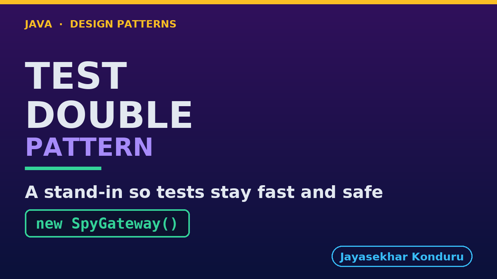

# YouTube — Test Double Pattern

Everything needed to publish `video/test-double-pattern-explained.mp4`. Copy the fields straight out of this file.

Chapter timings are generated from the video's `.srt`. Re-run `python3 docs/make_youtube_docs.py test-double` after any change to the narration, or they will be wrong.

## Title

```
Test Double (Dummy, Stub, Spy, Mock, Fake)
```

42 characters — under the 60 YouTube shows before truncating in search results.

## Description

The first two lines are what a viewer sees above the fold, so they carry the hook rather than the boilerplate.

```
A test double stands in for something your code depends on, so a test can run fast, offline, without real money, and ask exactly the question it needs. A test double takes the place of something your code depends on, so a test can run fast and offline and ask one precise question: a dummy for "unused", a stub for "what if", a spy for "what was called", a mock for "never anything else", and a fake for "the whole journey".

CHAPTERS
00:00 Introduction
01:16 The Scenario
01:45 Act One — The Real Provider
02:22 The Pattern
02:55 Act Two — A Dummy And A Stub
03:50 Act Three — A Spy
04:29 Act Four — A Mock
05:22 Act Five — A Fake
06:04 Five Doubles, Five Questions
06:37 Act Six — The Bill
07:26 What Doubles Cost
07:59 How To Recognise It
08:25 The Verdict
08:56 Thanks for Watching

SOURCE CODE, WRITTEN NOTES AND AN INTERACTIVE ANIMATION
https://github.com/jk-boot-up/java-design-patterns/tree/main/gradle-java/testing-design-patterns/test-double-pattern

WHAT YOU NEED FIRST
Java 21 and a working knowledge of classes and interfaces. No prior design-pattern knowledge is assumed. The full prerequisites are in docs/prerequisites.md in the repository.
```

## Chapters

YouTube renders these as chapters only if there are at least three and the first is at `00:00`.

```
00:00 Introduction
01:16 The Scenario
01:45 Act One — The Real Provider
02:22 The Pattern
02:55 Act Two — A Dummy And A Stub
03:50 Act Three — A Spy
04:29 Act Four — A Mock
05:22 Act Five — A Fake
06:04 Five Doubles, Five Questions
06:37 Act Six — The Bill
07:26 What Doubles Cost
07:59 How To Recognise It
08:25 The Verdict
08:56 Thanks for Watching
```

## Tags

```
test double, mock vs stub, unit testing, java testing, testing patterns, design patterns, java design patterns, gang of four, java 21, software design, clean code, object oriented design, java tutorial, ecommerce, programming tutorial
```

234 characters, under YouTube's 500 limit.

## Thumbnail



**Upload `docs/thumbnail.png`** — 1280×720, the size YouTube recommends, generated by `docs/make_thumbnails.py`. It is deliberately not the same image as the video's opening frame: a thumbnail is judged at about 360 pixels wide in a search result, so this one carries only the pattern name, one line of promise and one short piece of code, each set large enough to survive the shrink.

`video/poster.png` is the 1920×1080 opening frame, produced by the video build. It stays in the repository as the title card; it is not what gets uploaded.

YouTube will not pick the thumbnail up on its own — upload it under **Details → Thumbnail → Upload file**. A custom thumbnail requires a verified channel.

## Upload checklist

- [ ] Upload `video/test-double-pattern-explained.mp4` (1080p, H.264, 30 fps, AAC 48 kHz — already YouTube's recommended settings, no re-encode needed)
- [ ] Set the video language to **English** first, or the subtitle option may not appear
- [ ] Add subtitles: *Video elements → Add subtitles → Upload file → With timing* → `video/test-double-pattern-explained.srt`
- [ ] Upload `docs/thumbnail.png` as the thumbnail — do not let YouTube auto-pick a frame
- [ ] Paste the title, description and tags from above
- [ ] Add to the **Java Design Patterns** playlist, in learning order
- [ ] Wait for 1080p processing before sharing the link — code slides are unreadable at 360p

## Cards and end screen

End screen links to whichever pattern video goes up next — set it at upload time rather than assuming an order.

Add a card partway through pointing at the playlist, so a viewer who arrives at this pattern from search can find the rest of the series.

## Runtime

Approximately 09:50, narrated at 145 words per minute.
